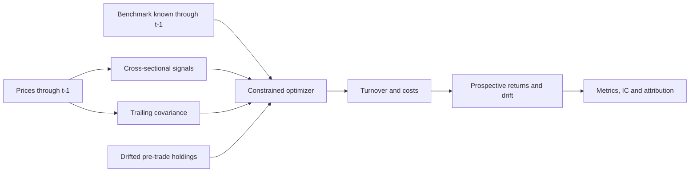

# PortfolioOS Benchmarked

[](https://github.com/Aniket2002/portfolioos-benchmarked/actions/workflows/ci.yml)

A reproducible Python research framework for studying how benchmark-relative
risk constraints and implementation frictions shape systematic portfolio
construction.

**Primary research question:** What is the trade-off between signal capture,
benchmark-relative risk and implementation cost in systematic portfolio
construction?

This is an applied quantitative-asset-management study of the portfolio-
construction mechanism:

```text
signal strength → desired active positions → constraints compress active positions
→ turnover limits restrict transitions → transaction costs reduce realized net return
```

The composite signal supplies a cross-sectional preference ranking. Portfolio
expression measures how much of that ranking appears in active weights; the
benchmark-risk and implementation budgets govern permissible deviation and trading;
realized gross and net returns are outcomes observed afterward. This sensitivity
analysis is not causal inference.

The included results are **SYNTHETIC**, not evidence of persistent real-world
alpha. A negative result is valid; the framework remains useful when it
underperforms. This is an educational research implementation, not a live
execution platform. No empirical performance claim is made.

## Quick start

Python 3.10–3.12 is tested in CI. From the repository root:

```sh
python -m venv .venv
# Activate .venv using your shell's activation command.
python -m pip install -e '.[dev]'
python scripts/run_demo.py --config configs/demo.yaml
python -m pytest -q --cov=portfolioos --cov-report=term-missing --cov-fail-under=80
python -m ruff check .
python -m ruff format --check .
```

Dependency installation and GitHub Actions provisioning need network access.
**Tests, package execution and the demo require no internet or API credentials.**
The short CI demo uses `--smoke-test` and writes `results/smoke/`; the full run
writes [results/demo/report.md](results/demo/report.md). Seeds are deterministic;
solver outputs may differ slightly across platforms or dependency versions.
Supported dependency ranges are in `pyproject.toml`.

## Interactive research app

Install and launch the optional Streamlit presentation layer from the repository
root:

```sh
python -m pip install -e '.[app]'
streamlit run streamlit_app.py
```

The app calls the existing PortfolioOS package and reporting infrastructure; it
contains no separate portfolio engine. Its default case study is deterministic
**synthetic data**, not historical performance or evidence of real-world alpha.
Optional price, benchmark and sector-metadata CSVs are handled in memory and
validated by the package. The Python package and CLI remain the canonical research
interfaces, and neither the app nor the demo needs market-data downloads or API
credentials.

## Architecture



| Modules | Responsibility |
| --- | --- |
| `data`, `synthetic` | Validation and deterministic market fixtures |
| `signals`, `covariance` | Transparent scores and trailing risk estimation |
| `optimizer` | CVXPY allocation and independent constraint validation |
| `backtest`, `costs` | Walk-forward timing, drift, turnover and costs |
| `metrics`, `attribution` | Performance, forward IC, security/sector effects |
| `reporting` | Configurations, reconciliation and research artifacts |
| `experiments` | Controlled signal-capture, risk and implementation frontiers |

The notebook is a presentation layer calling these modules.
Install `python -m pip install -e '.[notebook]'` for a notebook kernel and execution
dependencies, then select that environment in your notebook editor.

## Research experiments

Run the deterministic experiment suite with:

```sh
python scripts/run_experiments.py --config configs/demo.yaml
```

The research layer holds the dataset, dates, signals, covariance method, benchmark,
position limits, schedule and other settings fixed while varying one declared input.
It produces a 4%–12% annual tracking-error frontier, a 10%–50% one-way turnover
frontier, a 0–40 bps transaction-cost frontier, and a 3 × 3 TE/turnover surface.
Exact configurations and a dataset fingerprint accompany every row. An infeasible
scenario is reported and stopped; constraints are never relaxed.

Transaction-cost assumptions change net accounting only. They do not change asset
returns, signals or target weights. The optimizer contains a separate turnover
penalty, not an explicit expected transaction-cost model.

All included frontier outputs are **SYNTHETIC RESEARCH EXPERIMENTS**. They demonstrate
portfolio-construction mechanics and are not evidence that the signals earn
persistent real-world alpha. Parameter grids are declared in advance and negative
results remain visible.

A deterministic synthetic implementation-trade-off study is included in the
[canonical research report](results/research_tradeoffs/report.md).

## Synthetic findings

- Relaxing the annual tracking-error cap from 4% to 12% changed average signal
  capture only modestly, from 0.955 to 0.964.
- Relaxing the one-way turnover limit from 10% to 50% had a larger effect,
  increasing average signal capture from 0.846 to 0.974, while average realized
  rebalance turnover rose from 10.00% to 28.86%.
- Raising the transaction-cost assumption from 0 to 40 bps left gross annualized
  active return unchanged at -0.83% and reduced net annualized active return from
  -0.83% to -2.05%.

In this synthetic setup, turnover constraints were a more material limit on signal
expression than the tested tracking-error range, while transaction costs affected
realized net economics rather than portfolio formation.

These are synthetic controlled sensitivities, not evidence of alpha, causality,
statistical significance, or market performance.

## What “signal capture” means

At rebalance date *t*, using target weights and scores known at the same information
date:

```text
ActiveSignalExposure_t = (w_t - b_t)' s_t
SignalCapture_t = ActiveSignalExposure_t / ReferenceSignalExposure_t
```

The signal-expression reference portfolio uses the same signal, dates, benchmark and
basic position cap. It remains fully invested and long only, while tracking-error,
sector-active and turnover constraints and both optimizer penalties are removed. It
is deliberately less restrictive and exists only to provide an interpretable
denominator; it is not an “optimal alpha portfolio” or a more realistic strategy.
Near-zero reference exposures produce `NaN` rather than unstable ratios.

Signal capture measures how strongly active weights align with the chosen
cross-sectional signal. It does not measure skill, alpha, future excess return or
market inefficiency. High signal capture and poor subsequent performance can occur
together and constitute a legitimate result.

## Data and timing contract

Adjusted prices are a `DatetimeIndex × asset identifier` DataFrame. Dates must
be chronological and unique; identifiers must be unique nonempty strings.
Prices must be positive and finite. Missing data is rejected by default.
Optional `max_missing_fraction` applies per asset and `fill_limit` permits only
bounded **causal forward filling**. Leading or unresolved gaps fail. No backward
fill or automatic asset/date dropping occurs. Filling creates stale marks and
changes measured returns/volatility; the researcher must justify it.

The universe is fixed per run. Real research must establish point-in-time
membership, delisting treatment, corporate actions and historical adjustment
vintages. Retrospectively adjusted prices can themselves contain revisions.

For holdings earning close-to-close return on date **t**:

1. The exclusive slice `prices.iloc[:i]` ends at **t−1** for signals/covariance.
2. Benchmark and external-signal snapshots must be dated ≤ t−1.
3. Targets and costs are set before return t is observed.
4. Return t is applied, then holdings drift to the next pre-trade state.

This assumes idealized execution at the previous close after observing its
close. Real auction deadlines, processing time and slippage require an extra
lag or intraday data. The structural guarantee is no use of return t in weights
earning return t, not a claim that these closing fills are executable.
Adversarial tests mutate same-day/future prices, benchmark rows and external
signals and verify earlier weights are identical.

Default warmup is 253 prices (252 returns). Evaluation begins on the next
eligible date, even mid-month. Subsequent monthly rebalances use the first
observed trading day of a new month. Weekly/daily schedules are supported.
Start/end dates restrict evaluation while retaining earlier training history.

## Price-based signals

Let **s = t−1** denote the information date; offsets count observed trading days.

| Signal | Definition | Default |
| --- | --- | --- |
| 12−1 momentum | `P[s−21] / P[s−252] − 1` | Excludes latest 21 days |
| Low volatility | Negative trailing sample daily-return standard deviation | 63 returns |
| Short-term reversal | `−(P[s] / P[s−21] − 1)` | 21 days |

These are price signals, not fundamental value or quality factors. Each is
winsorized at its cross-sectional 5th/95th quantiles, then z-scored with population
standard deviation. Missing scores become neutral zero; constant or entirely
missing cross sections become zero. Normalization uses no future dates.

`score[i] = Σ beta[k] × z[k,i]`. Defaults are 1, 1 and 0.5, fixed in advance and
not normalized to sum to one. No evaluation-sample fitting of signal weights
occurs. An external signal is preprocessed identically; explicitly add an
`external` coefficient to use it. Its timestamps must represent availability,
not merely the underlying accounting period. Last known snapshots persist until
updated; the caller is responsible for assessing staleness.

## Covariance and portfolio optimization

[Ledoit–Wolf shrinkage](https://scikit-learn.org/stable/modules/generated/sklearn.covariance.LedoitWolf.html)
uses trailing 252 daily returns ending at s. The estimator demeans returns;
a daily diagonal ridge of `1e-10` supplies numerical stability. The matrix is
symmetric and positive semidefinite. `Σannual = 252 × Σdaily`.

```text
maximize    score' w − λrisk (w − wb)' Σannual (w − wb)
                    − λturnover ||w − wpretrade||₁

subject to  Σ w = 1
            0 ≤ wi ≤ position cap
            sqrt((w − wb)' Σannual (w − wb)) ≤ annual TE cap       [optional]
            |Σsector (w − wb)| ≤ sector active cap                [optional]
            0.5 ||w − wpretrade||₁ ≤ one-way turnover cap          [optional]
```

Scores are dimensionless preferences, **not annual expected-return forecasts**.
Risk and turnover coefficients are modelling tradeoffs, not calibrated utility.
The objective penalizes full L1; reported turnover and its cap use half L1.
Default coefficients are 10 and 0.1; caps are 8% position, 8% annual estimated TE,
10 percentage points sector active weight and 30% one-way turnover. Defaults
were chosen for transparent mechanics, not optimized synthetic performance.

[CLARABEL through CVXPY](https://www.cvxpy.org/tutorial/solvers/index.html)
requires no proprietary solver. Only an `optimal` solution passing independent
constraint checks is accepted. Numerical negative dust is clipped and holdings
normalized, then every constraint is rechecked with `1e-7` tolerance. Failures
are explicit and stop the backtest with date/status/reason. Configured benchmark
fallback (off by default) is allowed only if all constraints, including turnover,
remain satisfied. Constraints are never silently relaxed.

Caps apply at **rebalances**; drift may exceed position/sector limits and realized
TE may exceed estimated TE. Risk estimates are stored at rebalances, not
re-estimated daily. If metadata is omitted, explicitly set
`max_sector_active_weight: null`.

## Benchmark, drift, turnover and costs

Supplied benchmark rows are nonnegative target snapshots normalized to one.
Missing price assets receive zero weight; unknown constituents are rejected,
including unknown zero-weight columns. Rows take effect on the next observed
trading date. A repeated row supplied daily means daily target rebalancing.
Between updates, benchmark holdings drift. The latest known snapshot initializes
the evaluation period.

Without snapshots, the benchmark resets to **equal weight** at strategy rebalances
and drifts between them. It is not the S&P 500 or another named index. Benchmark
costs are excluded, as with a frictionless index comparison.

Both portfolios drift using `wnew[i] = w[i] × (1+r[i]) / (1+w'r)`.
Initial capital is endowed in benchmark holdings; the initial active transition
incurs turnover. Later turnover uses drifted pre-trade holdings:

```text
one_way_turnover = 0.5 × Σ |target − pretrade|
cost_fraction   = one_way_turnover × transaction_cost_bps / 10,000
net_return      = gross_return − cost_fraction
active_return   = net_return − benchmark_return
```

10 bps means 0.10% of starting NAV for a complete switch (turnover 1), not a
separate 10 bps charge on each buy/sell leg. Cost is deducted once using an
additive return approximation. A proportional fee leaves relative holdings
unchanged; drift uses gross asset returns. Exact cash/share execution accounting,
impact, taxes, funding, settlement, lot sizes and liquidity are outside v1.

## Metrics, IC and attribution

Annualizations use 252 observations/year; CAGR is `wealth^(252/n)−1`.
Volatility and realized TE use sample standard deviation. Sharpe uses mean daily
excess return ×252 / annual volatility; risk-free rate defaults to zero, with
an optional annual rate geometrically converted to daily. Sortino uses root mean
squared negative excess returns over **all days**. Drawdown includes starting
NAV 1. Undefined ratios are NaN in memory and JSON null in reports.

Active returns are arithmetic daily differences; information ratio is their mean
×252 / annual TE. The relative-wealth chart is portfolio wealth / benchmark
wealth −1, not compounded daily active returns. Annual turnover is total ×252/n.
Summed daily cost fractions and compounded gross-minus-net wealth drag are
reported separately. Average absolute active weight averages all securities/dates;
maximum position includes drift; average estimated TE uses rebalances only.

Forward signal IC is Spearman correlation between rebalance scores and asset
buy-and-hold returns from that effective date through the day before the next
rebalance. It is computed **after** simulation and never used in construction.
The terminal window may be partial and is flagged. Reports include mean, median,
standard deviation, fraction positive and mean/std (not annualized). No claim
of statistical significance or independent IC observations is made.

Security contribution is exactly `(w−wb) × asset_return` using beginning-of-day
holdings, summing to gross active return. Subtract daily cost for net active.
For sector weights Wp/Wb, within-sector returns Rp/Rb and total benchmark RB,
Brinson–Fachler effects are:

```text
allocation  = (Wp − Wb) × (Rb − RB)
selection   = Wb × (Rp − Rb)
interaction = (Wp − Wb) × (Rp − Rb)
```

Daily effects reconcile to gross active return. An absent side's sector return
is defined as zero; individual effects then depend on the convention, but the
total still reconciles. Daily effects are not linked into compounded multi-period
attribution; summing them is an arithmetic summary only.

## Synthetic case study and external data

The default generator uses 40 assets, five sectors, six 252-day years and seed 42.
Independent market/sector/idiosyncratic log-return shocks have heterogeneous
loadings and volatilities. **No predictive signal structure is embedded.**
There are no delistings, membership changes or factor-distribution regimes.
The business-day index is illustrative, not an exchange calendar.

See the [notebook](notebooks/research_case_study.ipynb) and
[synthetic report](results/demo/report.md). Outputs include JSON, metrics,
holdings, active holdings, returns, optimization statuses, scores, IC,
security/sector attribution and eight PNG charts. The summary records config/seed.
Only synthetic demo artifacts are tracked; other results and local data are ignored.

```python
import pandas as pd
from portfolioos import run_backtest
from portfolioos.reporting import load_config, write_report

prices = pd.read_csv("data/prices.csv", index_col=0, parse_dates=True)
benchmark = pd.read_csv("data/benchmark.csv", index_col=0, parse_dates=True)
metadata = pd.read_csv("data/metadata.csv", index_col=0)
_, config = load_config("configs/demo.yaml")
result = run_backtest(prices, benchmark, metadata, config=config)
write_report(result, "results/research", provenance="USER-SUPPLIED historical data")
```

Equivalent CLI:

```sh
python scripts/run_research.py --prices data/prices.csv \
  --benchmark data/benchmark.csv --metadata data/metadata.csv
```

Price/benchmark/signal CSVs have a date first column and asset columns. Metadata
has a ticker first column and `sector`. Optional `--signals` accepts publication-
dated snapshots. Nothing downloads data. Users must establish licenses, point-in-
time provenance, corporate-action handling, availability and defensible universes.
Provider inputs are never automatically copied or committed.

## Validation and limitations

CI runs Ruff, pytest with an **80% minimum coverage gate**, and an offline demo
on Python 3.10, 3.11 and 3.12. Tests cover known examples, solver failures,
constraints, timing mutations, drift, costs and attribution. See the
[adversarial review](docs/adversarial_review.md).

Coverage supports mechanics, not economic validity. Real research still needs
survivorship controls, realistic execution, cost sensitivity, changing universes,
regime analysis, independent holdouts and proper inference. No production
readiness, market calibration or institutional validation is claimed.

MIT licensed. Implementation is original to this repository.
