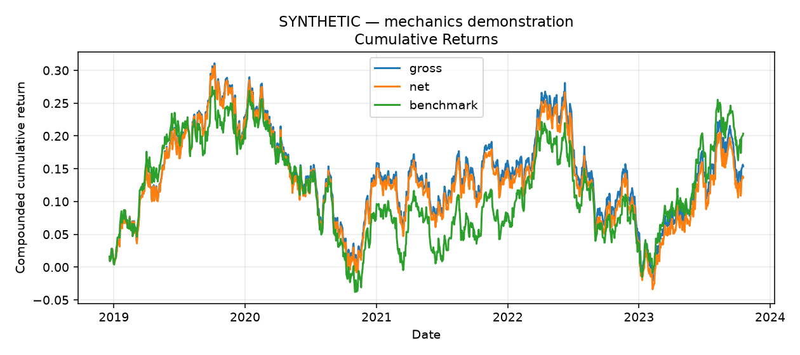
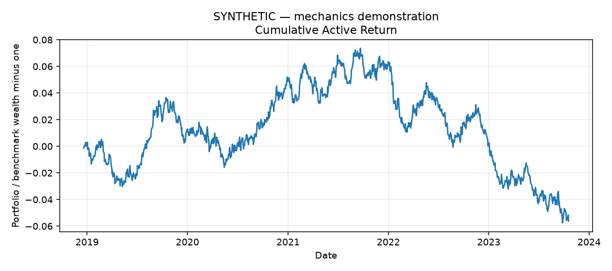
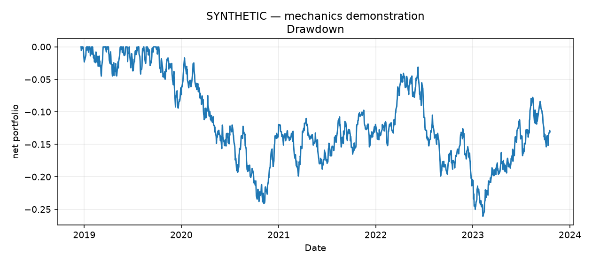
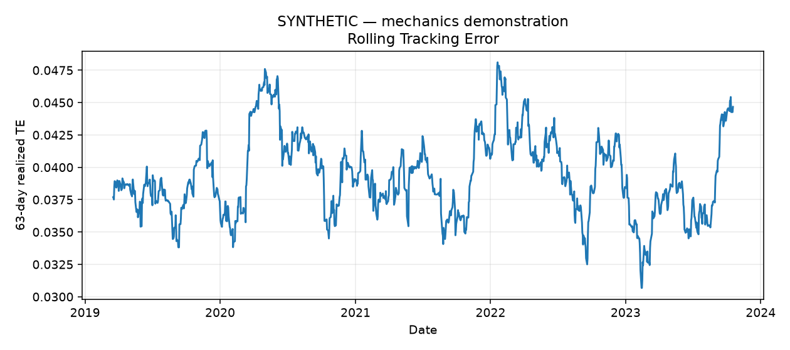
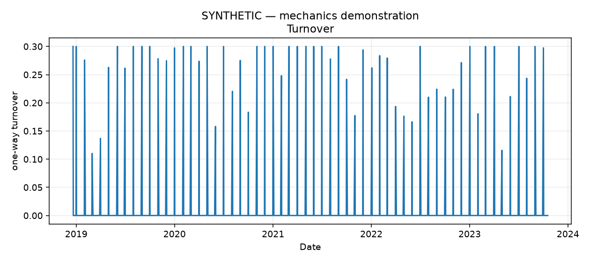
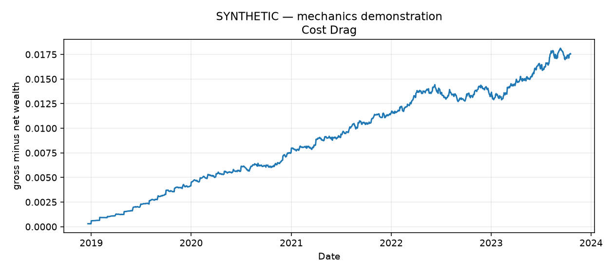
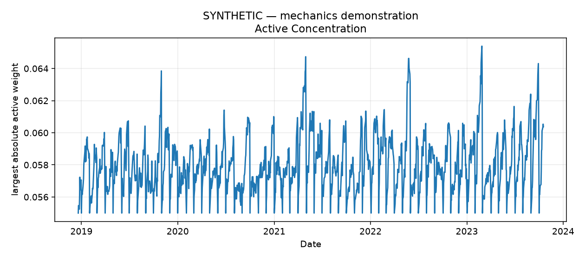
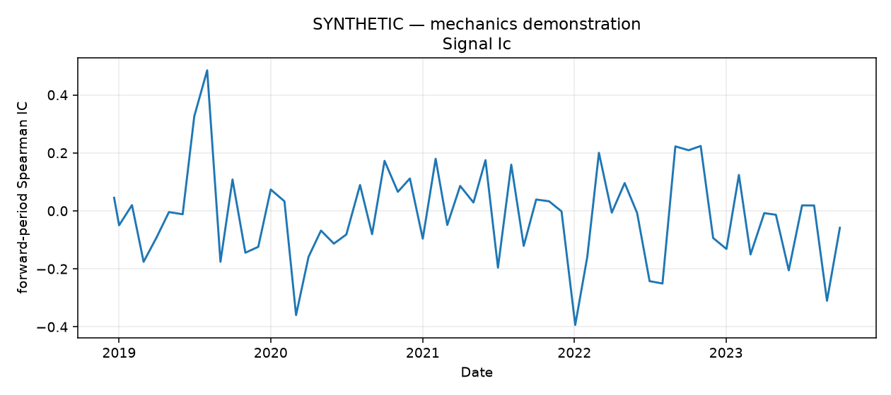

# PortfolioOS research report

**SYNTHETIC — mechanics demonstration**

This run evaluates mechanics, not persistent real-world alpha. Underperformance
is a valid outcome. No parameter search was used to choose demo defaults.

Evaluation: 2018-12-20 to 2023-10-18;
1260 daily observations and 59 rebalances.

| Metric | Value |
| --- | ---: |
| cumulative_return | 0.135966 |
| cagr | 0.025825 |
| annualized_volatility | 0.135611 |
| sharpe | 0.255794 |
| sortino | 0.362658 |
| maximum_drawdown | -0.260926 |
| benchmark_cumulative_return | 0.203560 |
| tracking_error | 0.039630 |
| information_ratio | -0.286032 |
| annualized_arithmetic_active_return | -0.011336 |
| annualized_turnover | 3.059248 |
| total_cost_fraction_sum | 0.015296 |
| compounded_cost_drag | 0.017549 |
| average_absolute_active_weight | 0.032179 |
| maximum_position | 0.094740 |
| average_estimated_tracking_error | 0.041840 |
| mean_ic | -0.013435 |
| median_ic | -0.007692 |
| ic_std | 0.164263 |
| ic_information_ratio | -0.081791 |
| positive_ic_fraction | 0.440678 |

Signal IC is evaluated after construction and never feeds the strategy.
The final IC window ends at the sample boundary and may be incomplete.
Undefined ratios are null in JSON, not infinity. Rolling TE requires 63 days.

Benchmark: equal-weight at strategy rebalances when no snapshots are supplied;
otherwise supplied target snapshots become effective on the next trading date.
Both portfolio and benchmark drift between their target updates.
Starting capital is endowed in benchmark holdings; the initial active transition
incurs turnover. Benchmark costs are excluded. Costs are the stated additive NAV
approximation, deducted once, with proportional holdings unchanged by the charge.

Security and Brinson-Fachler daily effects reconcile to gross active returns.
Subtract daily cost for net active return. Daily effects must not be described
as compounded multi-period attribution. Rebalance limits are not daily drift limits.

