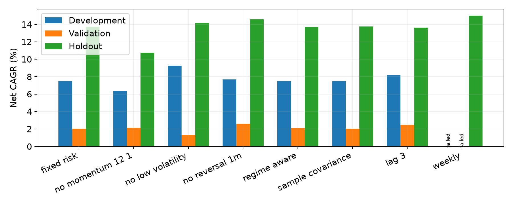
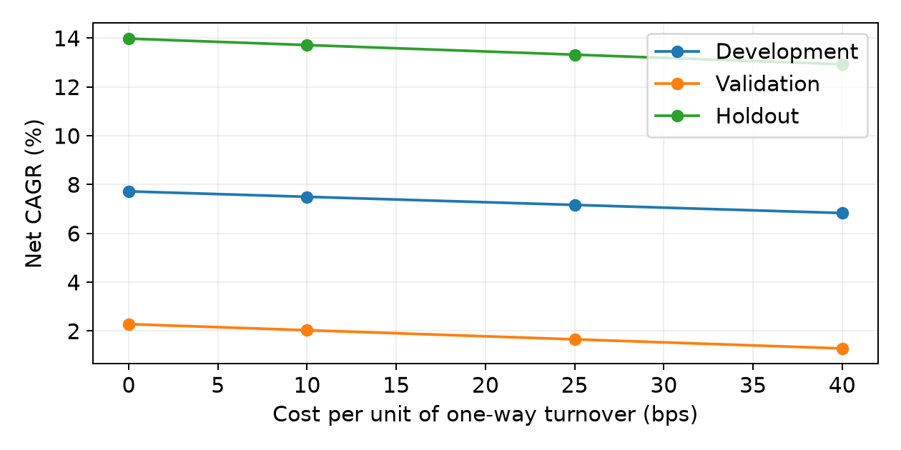
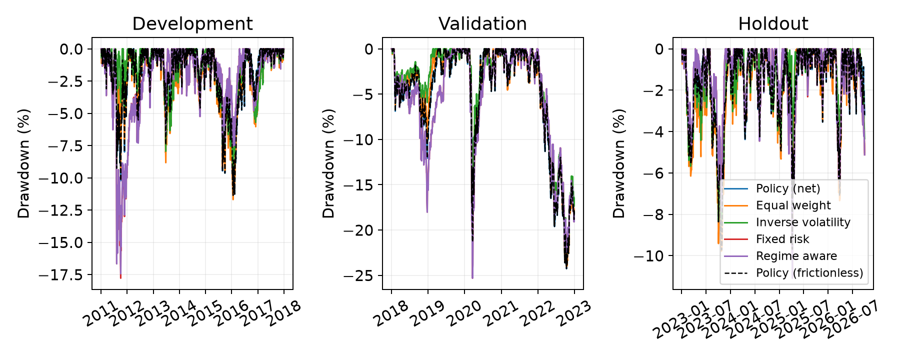
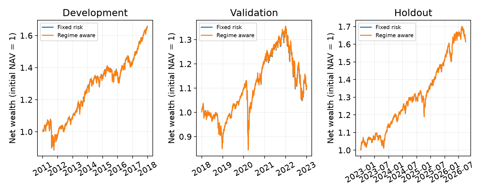
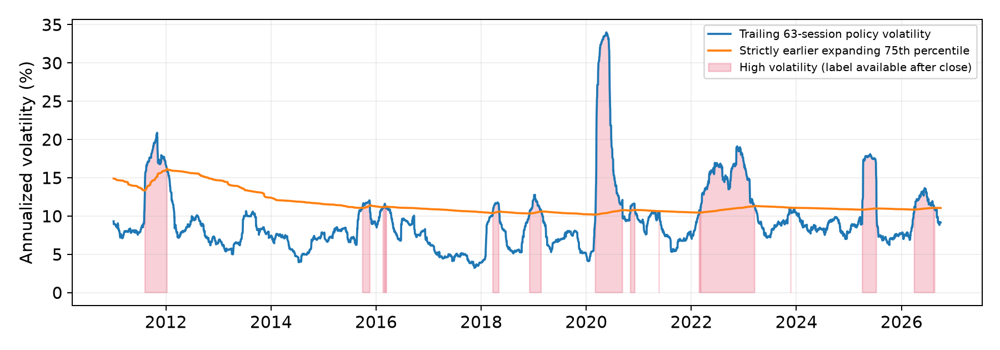
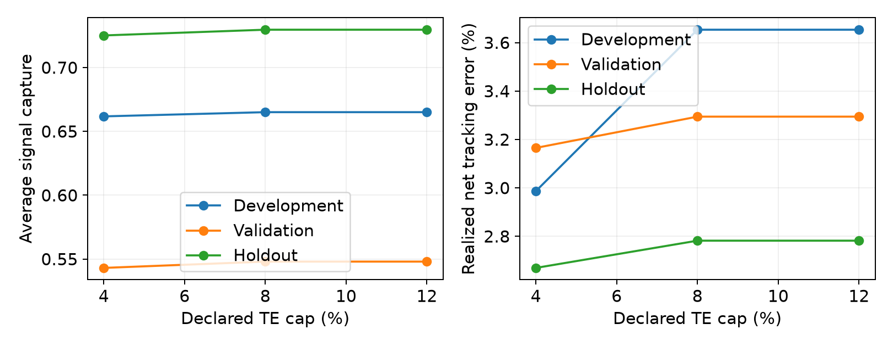
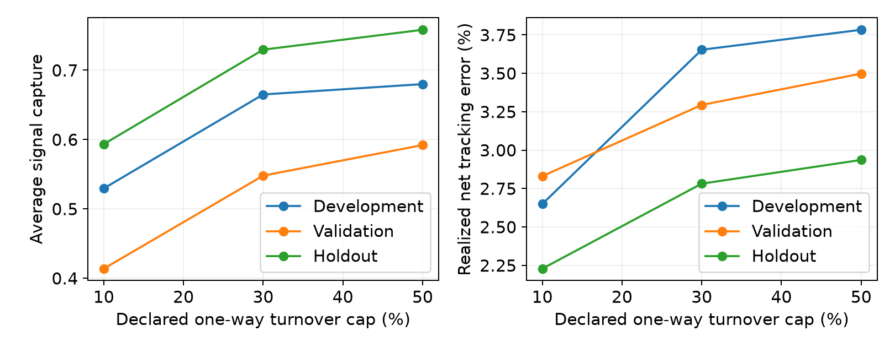
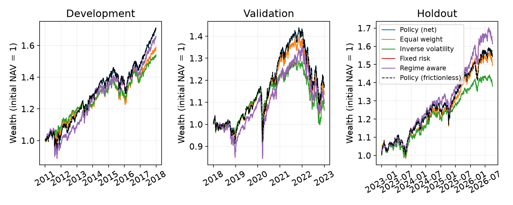

# Independent historical ETF research

This is independent research, not peer-reviewed research. No persistent-alpha or causal-regime claim is made.

Frozen code commit: `86a72b72584cf70e990525b62a7d4fab6e3649bd`. Dataset SHA-256: `5af0b0c65a9b4f8be569090f974c0b5446839a0bac20c3485d2184109cf981ea`.

Reader's guide: [paper](../../docs/empirical_manuscript.pdf), [methodology](../../docs/empirical_phase2.md), and [curated research index](../../docs/empirical_research_index.md). Detailed ledgers are retained for audit.

**Pre-holdout design revision:** after inspecting development/validation execution failures, Codex introduced formation reserves of 2 percentage points for turnover, 1 for sector exposure and 0.1 for annual TE. Execution mandates stayed unchanged. The corrected specification was frozen before the single holdout evaluation; the published results use that corrected specification.

## Historical periods

Warmup: 2009-01-02 to 2010-12-31. All evaluation boundaries follow the user proposal; periods start endowed in policy holdings and are evaluated independently.

## Experiment status

| Scenario | development | validation | holdout |
|---|---|---|---|
| cost_0bps | success | success | success |
| cost_10bps | success | success | success |
| cost_25bps | success | success | success |
| cost_40bps | success | success | success |
| equal_weight | success | success | success |
| fixed_risk | success | success | success |
| inverse_volatility | success | success | success |
| lag_3 | success | success | success |
| policy | success | success | success |
| regime_aware | success | success | success |
| sample_covariance | success | success | success |
| te_12pct | success | success | success |
| te_4pct | success | success | success |
| te_8pct | success | success | success |
| turnover_10pct | success | success | success |
| turnover_30pct | success | success | success |
| turnover_50pct | success | success | success |
| weekly | failed: Execution mandate failed on 2012-06-04: sector active weight, sector active weight | failed: Execution mandate failed on 2020-03-16: sector active weight | success |
| without_low_volatility | success | success | success |
| without_momentum_12_1 | success | success | success |
| without_reversal_1m | success | success | success |

Original zero-reserve failures remain in `results/empirical_phase2`. An interrupted reserve run remains locally in `results/empirical_phase2_final`. Reviewed runs are not replacements for those failure records.

## Primary performance and uncertainty

Returns below are net of 10 bps per unit of half-L1 turnover. Benchmark-relative metrics use the frictionless monthly policy; the independently cost-adjusted policy is also reported. Sharpe and Sortino use a declared zero risk-free rate. Percentages are annualized except drawdown and rebalance turnover.

### Development

| Strategy | Gross CAGR | Net CAGR | Realized TE | Arithmetic active | 95% block interval | Max drawdown |
|---|---|---|---|---|---|---|
| policy | 7.99% | 7.98% | 0.00% | -0.01% | [-0.01%, -0.01%] | -11.37% |
| equal_weight | 6.88% | 6.86% | 2.46% | -1.08% | [-2.96%, 0.73%] | -11.69% |
| inverse_volatility | 6.44% | 6.38% | 4.35% | -1.70% | [-4.26%, 1.01%] | -9.25% |
| fixed_risk | 7.72% | 7.50% | 3.65% | -0.38% | [-3.14%, 2.08%] | -17.78% |
| regime_aware | 7.71% | 7.49% | 3.63% | -0.40% | [-3.13%, 2.07%] | -17.44% |

Fixed-risk signal capture: 0.665; valid/excluded observations: 84/0; mean forward Spearman IC: 0.012. Policy frictionless/net CAGR: 7.99%/7.98%.

### Validation

| Strategy | Gross CAGR | Net CAGR | Realized TE | Arithmetic active | 95% block interval | Max drawdown |
|---|---|---|---|---|---|---|
| policy | 3.28% | 3.27% | 0.00% | -0.01% | [-0.02%, -0.01%] | -24.27% |
| equal_weight | 2.77% | 2.74% | 2.75% | -0.62% | [-2.47%, 1.45%] | -24.06% |
| inverse_volatility | 1.46% | 1.40% | 5.44% | -2.23% | [-5.82%, 1.71%] | -22.55% |
| fixed_risk | 2.28% | 2.03% | 3.29% | -1.15% | [-3.67%, 1.36%] | -25.32% |
| regime_aware | 2.33% | 2.09% | 3.25% | -1.09% | [-3.59%, 1.36%] | -25.32% |

Fixed-risk signal capture: 0.548; valid/excluded observations: 60/0; mean forward Spearman IC: -0.060. Policy frictionless/net CAGR: 3.28%/3.27%.

### Holdout

| Strategy | Gross CAGR | Net CAGR | Realized TE | Arithmetic active | 95% block interval | Max drawdown |
|---|---|---|---|---|---|---|
| policy | 12.33% | 12.32% | 0.00% | -0.01% | [-0.01%, -0.01%] | -9.73% |
| equal_weight | 11.40% | 11.38% | 2.84% | -0.85% | [-3.37%, 1.61%] | -9.78% |
| inverse_volatility | 9.09% | 9.03% | 3.75% | -3.16% | [-6.30%, 0.11%] | -8.35% |
| fixed_risk | 13.98% | 13.72% | 2.78% | 1.23% | [-1.55%, 3.90%] | -11.09% |
| regime_aware | 13.96% | 13.70% | 2.77% | 1.22% | [-1.57%, 3.90%] | -11.09% |

Fixed-risk signal capture: 0.730; valid/excluded observations: 45/0; mean forward Spearman IC: -0.019. Policy frictionless/net CAGR: 12.33%/12.32%.

## Constraint sensitivity, ablations and robustness

### A_tracking_error

| Period | Scenario | Status | Net CAGR | Capture | Ex-ante TE | Rebalance turnover | Active share |
|---|---|---|---|---|---|---|---|
| development | te_4pct | success | 7.79% | 0.662 | 3.02% | 17.27% | 42.72% |
| development | te_8pct | success | 7.50% | 0.665 | 3.21% | 17.21% | 43.94% |
| development | te_12pct | success | 7.50% | 0.665 | 3.21% | 17.21% | 43.94% |
| validation | te_4pct | success | 2.20% | 0.543 | 2.83% | 19.75% | 40.24% |
| validation | te_8pct | success | 2.03% | 0.548 | 3.11% | 20.40% | 41.62% |
| validation | te_12pct | success | 2.03% | 0.548 | 3.11% | 20.40% | 41.62% |
| holdout | te_4pct | success | 13.23% | 0.725 | 3.19% | 18.82% | 51.53% |
| holdout | te_8pct | success | 13.72% | 0.730 | 3.42% | 19.13% | 53.58% |
| holdout | te_12pct | success | 13.72% | 0.730 | 3.42% | 19.13% | 53.58% |

### B_turnover

| Period | Scenario | Status | Net CAGR | Capture | Ex-ante TE | Rebalance turnover | Active share |
|---|---|---|---|---|---|---|---|
| development | turnover_10pct | success | 8.00% | 0.529 | 2.64% | 7.27% | 37.55% |
| development | turnover_30pct | success | 7.50% | 0.665 | 3.21% | 17.21% | 43.94% |
| development | turnover_50pct | success | 7.53% | 0.680 | 3.32% | 20.52% | 45.80% |
| validation | turnover_10pct | success | 2.45% | 0.414 | 2.49% | 7.82% | 33.29% |
| validation | turnover_30pct | success | 2.03% | 0.548 | 3.11% | 20.40% | 41.62% |
| validation | turnover_50pct | success | 2.69% | 0.592 | 3.32% | 27.12% | 43.76% |
| holdout | turnover_10pct | success | 14.22% | 0.593 | 2.72% | 7.34% | 44.38% |
| holdout | turnover_30pct | success | 13.72% | 0.730 | 3.42% | 19.13% | 53.58% |
| holdout | turnover_50pct | success | 13.51% | 0.758 | 3.53% | 22.76% | 54.85% |

### C_costs

| Period | Scenario | Status | Net CAGR | Capture | Ex-ante TE | Rebalance turnover | Active share |
|---|---|---|---|---|---|---|---|
| development | cost_0bps | success | 7.72% | 0.665 | 3.21% | 17.21% | 43.94% |
| development | cost_10bps | success | 7.50% | 0.665 | 3.21% | 17.21% | 43.94% |
| development | cost_25bps | success | 7.17% | 0.665 | 3.21% | 17.21% | 43.94% |
| development | cost_40bps | success | 6.83% | 0.665 | 3.21% | 17.21% | 43.94% |
| validation | cost_0bps | success | 2.28% | 0.548 | 3.11% | 20.40% | 41.62% |
| validation | cost_10bps | success | 2.03% | 0.548 | 3.11% | 20.40% | 41.62% |
| validation | cost_25bps | success | 1.66% | 0.548 | 3.11% | 20.40% | 41.62% |
| validation | cost_40bps | success | 1.29% | 0.548 | 3.11% | 20.40% | 41.62% |
| holdout | cost_0bps | success | 13.98% | 0.730 | 3.42% | 19.13% | 53.58% |
| holdout | cost_10bps | success | 13.72% | 0.730 | 3.42% | 19.13% | 53.58% |
| holdout | cost_25bps | success | 13.32% | 0.730 | 3.42% | 19.13% | 53.58% |
| holdout | cost_40bps | success | 12.93% | 0.730 | 3.42% | 19.13% | 53.58% |

### D_regimes

| Period | Scenario | Status | Net CAGR | Capture | Ex-ante TE | Rebalance turnover | Active share |
|---|---|---|---|---|---|---|---|
| development | fixed_risk | success | 7.50% | 0.665 | 3.21% | 17.21% | 43.94% |
| development | regime_aware | success | 7.49% | 0.665 | 3.20% | 17.32% | 43.83% |
| validation | fixed_risk | success | 2.03% | 0.548 | 3.11% | 20.40% | 41.62% |
| validation | regime_aware | success | 2.09% | 0.546 | 2.98% | 19.94% | 41.01% |
| holdout | fixed_risk | success | 13.72% | 0.730 | 3.42% | 19.13% | 53.58% |
| holdout | regime_aware | success | 13.70% | 0.729 | 3.40% | 19.20% | 53.39% |

### E_ablations

| Period | Scenario | Status | Net CAGR | Capture | Ex-ante TE | Rebalance turnover | Active share |
|---|---|---|---|---|---|---|---|
| development | fixed_risk | success | 7.50% | 0.665 | 3.21% | 17.21% | 43.94% |
| development | regime_aware | success | 7.49% | 0.665 | 3.20% | 17.32% | 43.83% |
| development | without_momentum_12_1 | success | 6.35% | 0.419 | 2.45% | 17.20% | 36.82% |
| development | without_low_volatility | success | 9.26% | 0.629 | 4.67% | 21.10% | 60.20% |
| development | without_reversal_1m | success | 7.68% | 0.689 | 3.08% | 10.44% | 43.28% |
| validation | fixed_risk | success | 2.03% | 0.548 | 3.11% | 20.40% | 41.62% |
| validation | regime_aware | success | 2.09% | 0.546 | 2.98% | 19.94% | 41.01% |
| validation | without_momentum_12_1 | success | 2.14% | 0.385 | 2.97% | 19.81% | 43.33% |
| validation | without_low_volatility | success | 1.31% | 0.576 | 4.77% | 20.64% | 56.23% |
| validation | without_reversal_1m | success | 2.59% | 0.604 | 2.98% | 12.23% | 41.58% |
| holdout | fixed_risk | success | 13.72% | 0.730 | 3.42% | 19.13% | 53.58% |
| holdout | regime_aware | success | 13.70% | 0.729 | 3.40% | 19.20% | 53.39% |
| holdout | without_momentum_12_1 | success | 10.75% | 0.423 | 2.83% | 16.53% | 44.17% |
| holdout | without_low_volatility | success | 14.20% | 0.594 | 4.27% | 20.96% | 61.20% |
| holdout | without_reversal_1m | success | 14.58% | 0.807 | 3.59% | 10.96% | 56.61% |

### F_strategies

| Period | Scenario | Status | Net CAGR | Capture | Ex-ante TE | Rebalance turnover | Active share |
|---|---|---|---|---|---|---|---|
| development | policy | success | 7.98% | undefined | 0.00% | 0.88% | 0.00% |
| development | equal_weight | success | 6.86% | undefined | 2.56% | 1.56% | 40.03% |
| development | inverse_volatility | success | 6.38% | undefined | 4.20% | 4.24% | 38.08% |
| development | fixed_risk | success | 7.50% | 0.665 | 3.21% | 17.21% | 43.94% |
| development | regime_aware | success | 7.49% | 0.665 | 3.20% | 17.32% | 43.83% |
| validation | policy | success | 3.27% | undefined | 0.00% | 1.11% | 0.00% |
| validation | equal_weight | success | 2.74% | undefined | 2.76% | 1.88% | 40.03% |
| validation | inverse_volatility | success | 1.40% | undefined | 5.17% | 5.07% | 39.46% |
| validation | fixed_risk | success | 2.03% | 0.548 | 3.11% | 20.40% | 41.62% |
| validation | regime_aware | success | 2.09% | 0.546 | 2.98% | 19.94% | 41.01% |
| holdout | policy | success | 12.32% | undefined | 0.00% | 0.76% | 0.00% |
| holdout | equal_weight | success | 11.38% | undefined | 2.82% | 1.89% | 40.03% |
| holdout | inverse_volatility | success | 9.03% | undefined | 3.63% | 4.47% | 38.23% |
| holdout | fixed_risk | success | 13.72% | 0.730 | 3.42% | 19.13% | 53.58% |
| holdout | regime_aware | success | 13.70% | 0.729 | 3.40% | 19.20% | 53.39% |

### G_robustness

| Period | Scenario | Status | Net CAGR | Capture | Ex-ante TE | Rebalance turnover | Active share |
|---|---|---|---|---|---|---|---|
| development | fixed_risk | success | 7.50% | 0.665 | 3.21% | 17.21% | 43.94% |
| development | sample_covariance | success | 7.49% | 0.665 | 3.08% | 17.25% | 43.95% |
| development | lag_3 | success | 8.18% | 0.653 | 3.18% | 17.60% | 44.72% |
| development | weekly | failed | undefined | undefined | undefined | undefined | undefined |
| validation | fixed_risk | success | 2.03% | 0.548 | 3.11% | 20.40% | 41.62% |
| validation | sample_covariance | success | 2.03% | 0.548 | 2.98% | 20.37% | 41.72% |
| validation | lag_3 | success | 2.46% | 0.534 | 3.11% | 21.24% | 42.04% |
| validation | weekly | failed | undefined | undefined | undefined | undefined | undefined |
| holdout | fixed_risk | success | 13.72% | 0.730 | 3.42% | 19.13% | 53.58% |
| holdout | sample_covariance | success | 13.76% | 0.730 | 3.11% | 19.14% | 53.97% |
| holdout | lag_3 | success | 13.64% | 0.738 | 3.34% | 19.19% | 52.76% |
| holdout | weekly | success | 14.99% | 0.747 | 3.54% | 10.04% | 54.45% |

## Regime comparisons

Conditional summaries use daily information-date labels, rather than the state held since the last rebalance. The 8%/5% budget changes only at scheduled rebalances. Conditional arithmetic means are descriptive; no discontinuous-subsequence CAGR or causal inference is reported.

| Period | Strategy | State | Days | Arithmetic active | Realized TE |
|---|---|---|---|---|---|
| development | fixed_risk | normal | 1607 | -0.56% | 3.24% |
| development | fixed_risk | high | 154 | 1.51% | 6.58% |
| development | regime_aware | normal | 1607 | -0.58% | 3.25% |
| development | regime_aware | high | 154 | 1.53% | 6.37% |
| validation | fixed_risk | normal | 810 | -0.76% | 2.79% |
| validation | fixed_risk | high | 449 | -1.86% | 4.06% |
| validation | regime_aware | normal | 810 | -0.69% | 2.77% |
| validation | regime_aware | high | 449 | -1.83% | 3.98% |
| holdout | fixed_risk | normal | 722 | 1.51% | 2.55% |
| holdout | fixed_risk | high | 217 | 0.33% | 3.46% |
| holdout | regime_aware | normal | 722 | 1.51% | 2.54% |
| holdout | regime_aware | high | 217 | 0.24% | 3.44% |

Development regime-aware minus fixed-risk annualized arithmetic return: -0.02%, paired 95% block interval [-0.12%, 0.10%].

Validation regime-aware minus fixed-risk annualized arithmetic return: 0.05%, paired 95% block interval [-0.07%, 0.18%].

Holdout regime-aware minus fixed-risk annualized arithmetic return: -0.02%, paired 95% block interval [-0.10%, 0.05%].

## Interpretation and limitations

The 8% and 12% TE configurations have essentially identical performance, consistent with largely non-binding TE caps at those settings. Turnover restricted signal expression more than the tested 4%–12% TE range under this model, objective, universe and other constraints. This conditional sensitivity result does not establish that turnover is generally more important than tracking error in portfolio management. Increased signal capture cannot establish better returns. Cost sensitivities clone identical weights, gross returns and turnover; only net accounting changes. Ablation capture has a different signal-specific reference denominator, so cross-ablation ratios are not cardinal measures of relative skill.

Weekly failures are execution-mandate violations; no full-period performance is assigned to interrupted paths. The safety margins are not execution guarantees. No constraints were relaxed, and no better-performing ablation was promoted to the primary model.

Circular blocks of 21 sessions, 2,000 resamples and seed 20261008 provide descriptive percentile intervals for annualized arithmetic paired active returns. Approximate within-period stationarity and within-block dependence are assumed. Structural breaks, regime persistence, limited holdout length, a fixed block length and multiple comparisons limit interpretation; no independent-daily significance test is used.

The fixed surviving ETF universe is retrospectively selected. Prices use a latest retrieval vintage, not contemporaneous adjustment vintages. Yahoo-derived non-institutional data lack independent institutional price validation. The operator offers an open educational API; upstream redistribution rights are not independently verified. Raw data remain outside Git. ETF expenses are embedded in prices; taxes, impact, borrow/funding, share lots and settlement are omitted. Weight-target fills at the previous close are research approximations, not guaranteed executable trades. Zero-rate Sharpe is not excess over historical Treasury-bill returns.

Source verification exposed incidental issuer quotes/performance panels in the holdout era; the full panel was loaded for ingestion QA. No constructed holdout portfolio performance was used for parameter selection. This is retrospective pseudo-out-of-sample research, not prospective preregistration.

## Figures

## Reproduction

The original market-data bundle is retained locally and is not publicly available. Exact-input reproduction requires that bundle, the frozen model/protocol and compatible recorded dependencies, with solver tolerances allowed. Fingerprints establish identity but cannot supply the missing inputs. A fresh provider retrieval supports approximate replication using a new labelled vintage; revised historical prices may change results. Public ledgers permit evidence inspection, not independent reconstruction from source prices. See [the reproduction routes and commands](../../docs/empirical_phase2.md#external-reproducibility). `all_performance.csv` contains every computed primary metric. Undefined metrics are null/NaN and are never replaced by zero. Original evaluations are never overwritten.
